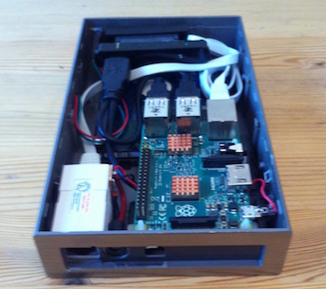

# pi-node
Raspberry PI 2 based Bitcoin full node - [Live Dashboard](http://pi-node.bealearts.co.uk)

[](https://raw.githubusercontent.com/DavidBeale/pi-node/master/img/open-case.jpg)
[](https://raw.githubusercontent.com/DavidBeale/pi-node/master/img/closed-case.jpg)

## BOM
1. Raspberry PI 2 Model B
2. Chip Heatsink x2

## Hardware Installation

1. Attach the Heatsink to the CPU and 
2. Insert the SD card.
3. Attach network and power cables.


## Software Installation

### OS
Ubuntu 14.02 Server for PI 2 [Instructions](http://blog.bobbyallen.me/2015/05/17/setting-up-and-running-a-server-with-ubuntu-server-14-04-on-raspberry-pi-2/)

### Update OS
```shell
sudo apt-get update
sudo apt-get upgrade
```

### Build Tools
```shell
sudo apt-get install build-essential libtool autotools-dev autoconf pkg-config libssl-dev libboost-all-dev
```

### External UBB HDD Mount
```shell
sudo mkdir /hdd
sudo mount /dev/sda1 /hdd
sudo echo /dev/sda1  /hdd ext4  defaults  0 0 >> /etc/fstab
```

### Swap Memory
```shell
sudo apt-get install dphys-swapfile
```

### NTP
```shell
sudo apt-get install ntp
sudo dpkg-reconfigure tzdata
```

### Compile bitcoind
```shell
sudo mkdir /hdd/bitcoind
sudo mkdir /hdd/bitcoind/src
sudo chown ubuntu:ubuntu /hdd/bitcoind/src
cd /hdd/bitcoind/src
wget https://github.com/bitcoin/bitcoin/archive/v0.11.1.zip  # Check for a newer version
unzip v0.11.0.zip
cd bitcoin-0.11.0
./autogen.sh
./configure --disable-wallet --with-incompatible-bdb
make # This will take a long time!
cd src
strip bitcoind
strip bitcoin-cli
sudo mv bitcoind /usr/bin/
sudo mv bitcoin-cli /usr/bin/
```

### Setup bitcoind
```shell
sudo useradd -m bitcoind
sudo mkdir /etc/bitcoind
sudo mkdir /hdd/bitcoind/data
sudo chown bitcoind:bitcoind /hdd/bitcoind/data
sudo wget https://raw.githubusercontent.com/DavidBeale/pi-node/master/etc/bitcoind.conf > /etc/bitcoind.conf
sudo wget https://raw.githubusercontent.com/DavidBeale/pi-node/master/etc/init/bitcoind.conf > /etc/init/bitcoind.conf
sudo nano /etc/bitcoind.conf # Edit the password to a secure one i.e. generated by bash -c 'tr -dc a-zA-Z0-9 < /dev/urandom | head -c32 && echo'
```

### Start bitcoind
```shell
sudo service bitcoind start
sudo tail -f /var/log/upstart/bitcoind.log  # Check the service starts
sudo tail -f /hdd/bitcoind/data/debug.log # Check startup and progress - will take several hours/days to fully sync!
```
### Web Dashboard
Install [BTCnDash](https://bitbucket.org/mattdoiron/btcndash) by following the instructions in /doc/installation.rst
